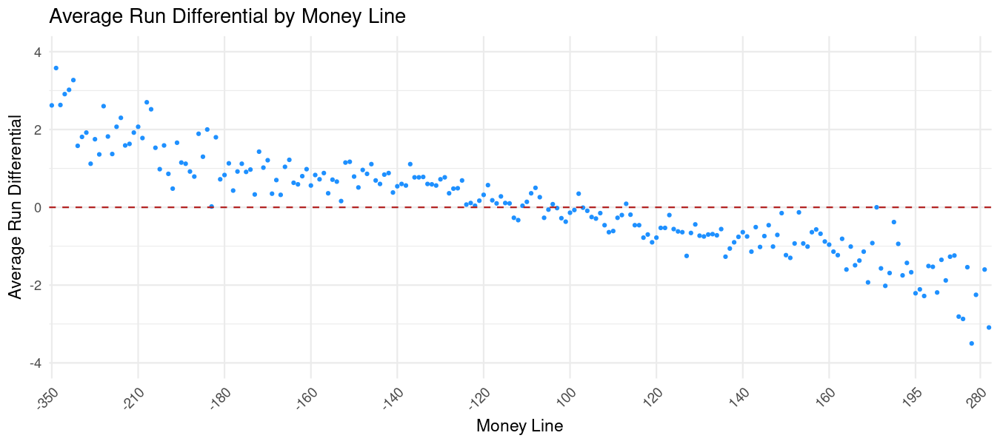

# Coursera-Project

**Introduction**

For my Google Data Analytics Capstone Project, I chose track 2. I will be using the six phases of data analysis for this project (ask, prepare, process, analyze, share, & act). I used several tools to complete this project, specifically spreadsheets (excel), SQL (BigQuery) and R ( R Studio).

**Background**

In this case study scenario, I am providing an analysis of Major League Baseball odds data to FantasyAce, a website that provides projections, software tools and advice for fantasy sports and sports betting.

## Ask

**Business Question:** How accurate are the lines set by sports books on Major League Baseball games?

Sportsbooks utilize experienced handicappers and extensive historical data to set initial odds for games and events. Once these lines are posted, they are adjusted based on the betting activity. For instance, if a sportsbook sets an opening line for total runs in a game at 8.5, this line might shift as bets are placed. The sportsbook tracks every wager and uses this data to identify successful bettors, adjusting the odds accordingly. If professional gamblers place substantial bets on the over, the sportsbook might move the line up to 9. This dynamic adjustment process ensures that the lines remain efficient, reflecting both the sportsbook’s historical data and the insights of skilled handicappers and gamblers.

FantasyAce leverages these adjusted odds to uncover profitable betting opportunities, enhance player projections, and provide guidance on the sports betting landscape. However, to refine our understanding and better communicate these odds to our customers, we need to analyze their predictive value by addressing how often the favorite for each type of line actually covers.

How often does the money line favorite win?
How often does the side favored on a total bet cover?
How often does the run line odds favorite cover the run line?

For this analysis, we define a “cover” as follows:

 - money line =  money line < opponent money line AND runs > opponent runs
 - over total = (runs + oppRuns) > total
 - under total = (runs + oppRuns) < total
 - Run line: (oppRuns - runs) < runLine

By answering these questions, we aim to improve our understanding of odds and enhance our ability to provide valuable insights to our customers.

## Prepare

FantasyAce has sourced Major League Baseball odds data from the online sportsbook ActionSports.com. This dataset consists of 10 separate CSV files, each corresponding to a season from 2012 to 2021. Each file contains one row for every team participating in each regular season game, with columns detailing the team, date, and the corresponding sportsbook odds. These files have been uploaded to BigQuery.

The data does not include the game results, so I need to collect this information and attach it to the odds data. Specifically I need the number of runs scored by each team. I also need to calculate the total runs scored by both teams in a game, equal to runs plus opponent runs. To obtain the missing game results, I used the R package “retrosheet.” This package provides tools to import baseball data from retrosheet.org, a source of free baseball statistics, which is copyrighted by Retrosheet. 

## Process

I used excel to open and work with the 10 odds data csv files. I created pivot tables and a plot for each file. 

- [2012](https://storage.googleapis.com/mlb_odds/odds2012.xlsx)
- [2013](https://storage.googleapis.com/mlb_odds/odds2012.xlsx)
- [2014](https://storage.googleapis.com/mlb_odds/odds2014.xlsx)
- [2015](https://storage.googleapis.com/mlb_odds/odds2014.xlsx)
- [2016](https://storage.googleapis.com/mlb_odds/odds2016.xlsx)
- [2017](https://storage.googleapis.com/mlb_odds/odds2016.xlsx)
- [2018](https://storage.googleapis.com/mlb_odds/odds2018.xlsx)
- [2019](https://storage.googleapis.com/mlb_odds/odds2018.xlsx)
- [2020](https://storage.googleapis.com/mlb_odds/odds2020.xlsx)
- [2021](https://storage.googleapis.com/mlb_odds/odds2020.xlsx)

I then uploaded these files to BigQuery. I used SQL to join these tables together and then uploaded these into R Studio. Click [here](https://github.com/MrLuck99/Coursera-Project/blob/main/SQL) to see the SQL query used to join the files.

I then used the “retrosheet” package to obtain the necessary game data. I saved this as "gameLogs". Click [here](https://github.com/MrLuck99/Coursera-Project/blob/main/retrosheet%20data) to see the r code used to fetch game data using the retrosheet package.

## Analyze

The game logs have data for both teams in each game in a single row.  The odds data contains a separate row for each team in every game, so I had to divide the game logs into separate rows for each team. In order to merge this data with the odds data, I completed the following steps:

  - separate rows into visiting and home team columns
  - change 'visiting' and 'home' team to columns to 'team' and 'opponent'
  - changed the team abbreviations
  - changed date column from integer to date format 
  - created game number column from double header info 
  - created 'season' column by extracting year from date column
  - selected columns needed for analysis
    
Click [here](https://github.com/MrLuck99/Coursera-Project/blob/main/edit%20retrosheet%20data) to view code.

I then merged this data with our odds data. I also created separate columns for: 

  - opponent money line
  - opponent run line
  - opponent run line odds
  - total runs (runs + opponent runs)

Click [here](https://github.com/MrLuck99/Coursera-Project/blob/main/merge%20odds%20and%20game%20logs) to view code.

Before I started my analysis, I used the summary() function to check the data for missing values.  There are some NA values in the runLine and runLineOdds columns that I need to account for later on.

This gave me a sample of 45,530 rows of data representing each team involved in 
22,765 games. I selected a sample row from our data to help explain each type of line. I then
started my analysis by calculating the count of each type of line, how often
the favorite covered this line, and the percentage of time the line covered.  I used this
data to create a summary table and a plot for each of our line types.

#### Money Line

The money line is simply the odds that a team will win a game outright.  For instance, we might see a line like this:

New York -140 @ Oakland +155

The team with the smaller number, in this case New York at -140, is considered the money line favorite.  Whoever wins, regardless of score, covers. If the money line is even for both teams, then neither team is a money line favorite. 
In our data set, there are 22,195 favorites, 22,195 underdogs, and 1,140 instances where both teams have the same money line. 

| Money Line | Count | Cover | Percentage |
| ------------ | ----------- | ------------ | ------------ |
| favorites | 22195 | 12938 | 58.3 |
| dogs | 22195 | 9256 |	41.7 |
| even | 1140 | - | - |

This first plot shows the strong relationship between the strength of the money line and the likeliehood of covering.  As the money line gets smaller, the chances of winning increase.

This second plot shows a similar relationship between the money line and the run differential.  As the money line gets smaller, the average margin of victory increases.

#### Run Line

Run lines are the baseball version of a point spread. The spread is always 1.5 runs, meaning the favorite must win by two or more runs to cover the spread, or the underdog must lose by one run or win the game outright to cover the spread. In this example, Houston is favored to win the game, with a run line of -1.5.  However, they are not a favorite to cover this spread, with odds of +150. Therfore, Chicago is favored to cover the run line. 

Chicago&nbsp;&nbsp;&nbsp; +1.5&nbsp;&nbsp;&nbsp;&nbsp;-182

 @

Houston&nbsp;&nbsp;&nbsp; -1.5&nbsp;&nbsp;&nbsp;&nbsp;+150

| Run Line | Count | Favorites | Cover | Percentage |
| ------------ | ----------- | ------------ | ------------ | ------------ |
| -1.5 | 17904 | 2344 | 1271 | 54.2 |
| +1.5 | 17904 | 15098 |	8985 | 59.5 |
| Total | 35808 | 17442 | 10256 | 58.8 |

This first run line plot demonstrates the relationship between the strength of the run line odds and the chances of covering. As the odds get stronger, the chances of covering increase.

This second plot shows the run differential by run line odds.  The blue dots above the top dotted line, and the red dots between the two dotted lines represent covers.

#### Total
 The total is the line set on the number of runs scored in a game by both teams.  Each side of this line is assigned odds.  For example, in this game between Saint Louis and Milwaukee, the total has been set at 7.5 and the over is favored with odds of -128.:

Saint Louis @ Milwaukee

O 7.5  -128

U 7.5  +104  

In our data set, we have 9,106 games where the over was favored, 9,561 where the under was favored, and 4098 games where neither side was favored.

| Favorite | Count | Cover | Percentage |
| ------------ | ----------- | ------------ | ------------ |
| over | 9106 | 4377 | 48.1 |
| under | 9561 | 4738 |	49.6 |
| even | 4098 | - | - |
| all fav | 18666 | 9116 | 48.4 |

This plot shows the relationship between the strength of the odds for the game total line and the chance of covering.  Unlike the money line, there isn't a very strong correlation between the strength of the odds and the chance of covering.  

This next plot helps to explain the weak correlation.  We can see that the average difference between the game total and the actual runs scored is just 0.46.  However, the standard deviation of that difference is 4.35.  This wide variance could help explain the lower percentage of game total favorites that cover as compared to the favorites in the other types of odds in our analysis. 

## Share

### **Summary**

| Favorite | Percent Covered |
| ------------ | ----------- |
| Run Line Dogs | 59.5 |
| Run Line Odds (overall) | 58.8 |
| Money Line | 58.3 |
| Run Line Favorites | 54.2 |
| Under | 49.6 |
| Total (overall) | 48.4 |
| Over | 48.1 |

## Act

Run line odds favorites and money line favorites successfully cover over 58% of the time, with teams favored as run line underdogs showing the highest success rate at 59.5%. The data indicates that the most exploitable lines for sports bettors are those related to game totals. While the predicted game total generally aligns with actual runs scored, the high variance results in less reliable outcomes for over/under bets. Based on these findings, FantasyAce should prioritize run line and money line odds for their predictive value when developing player projections and models, while also targeting over/under lines to identify inefficiencies that could lead to profitable wagering opportunities.
